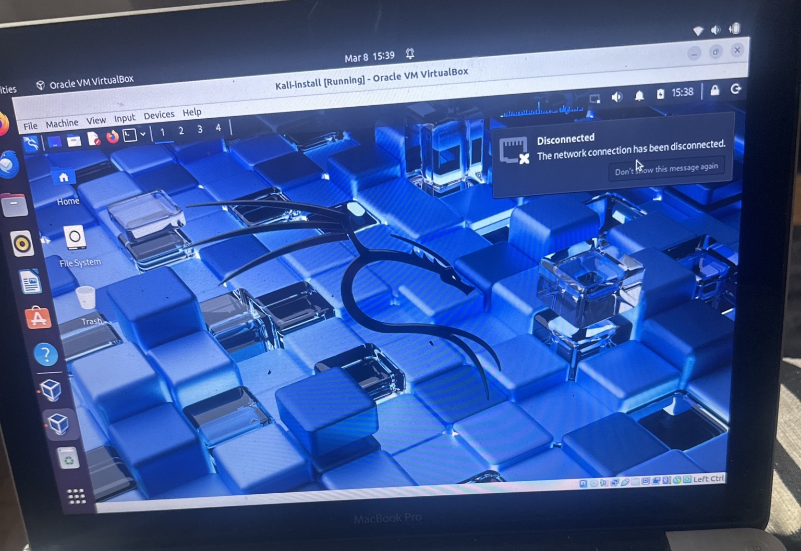
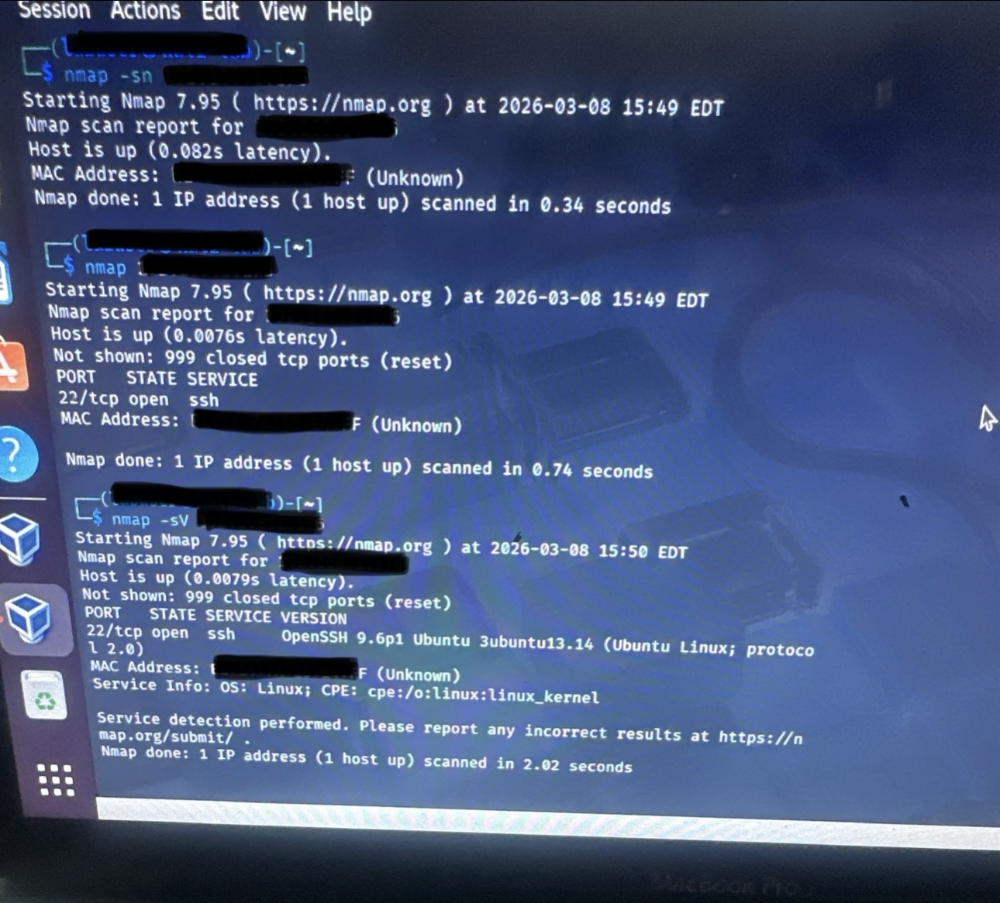
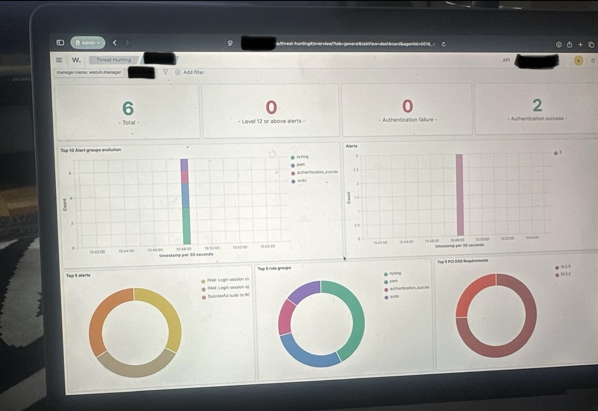
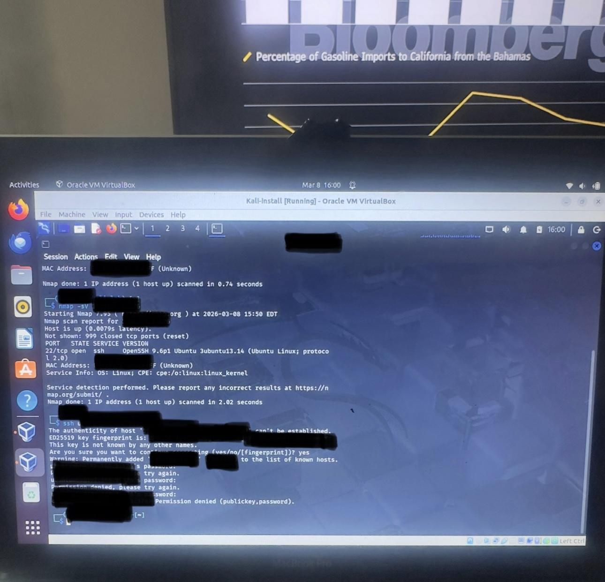

## Evidence and Screenshots

### 1. Kali Linux Attacker VM

The Kali virtual machine used to simulate attacker activity in the lab.

### 2. Nmap Reconnaissance Results

Nmap identified the target host as active and detected an open SSH service on port 22.

### 3. SSH Access Attempt

An SSH login attempt was made from the Kali system to the Ubuntu target. The login attempt failed, but it generated authentication-related activity for review.

### 4. Wazuh Dashboard Overview

The Wazuh dashboard displayed collected security events from the monitored endpoint.

### 5. Wazuh Authentication Alerts

Wazuh reflected multiple authentication-related events associated with the SSH attempt.

