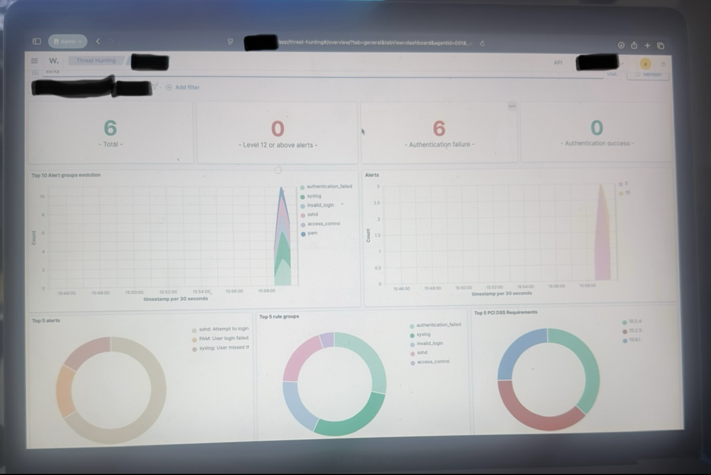

## Project Overview
This project demonstrates a basic SOC-style detection and investigation workflow built in a home lab environment. The goal was to simulate attacker activity from a Kali Linux machine, observe exposed services on a target Ubuntu endpoint, attempt SSH access, and review how Wazuh captured related security events.

This lab was designed to help build practical skills in:
- Security monitoring
- SIEM analysis
- Linux host visibility
- Network reconnaissance awareness
- Authentication event investigation
- SOC analyst workflow documentation

## Lab Objective
The purpose of this project was to simulate a simple attack path and document the detection process from start to finish.

The workflow included:
1. Launching a Kali Linux attacker VM
2. Running Nmap scans against a monitored Ubuntu endpoint
3. Identifying an exposed SSH service on port 22
4. Attempting SSH access to the target
5. Reviewing Wazuh dashboards for authentication-related alerts and security events

## Lab Environment

### Systems Used
- **Attacker Machine:** Kali Linux running in VirtualBox on a MacBook Pro
- **Target Endpoint:** Ubuntu endpoint monitored by Wazuh
- **Security Platform:** Wazuh SIEM
- **Analyst Viewpoint:** Reviewing logs and alerts through the Wazuh dashboard

### Tools Used
- **Kali Linux**
- **Nmap**
- **SSH**
- **Wazuh**
- **VirtualBox**

## Attack Scenario
A Kali Linux VM was used to perform reconnaissance against a monitored Ubuntu system. Nmap identified the host as active and revealed that port 22 was open, indicating SSH was available. An SSH login attempt was then made from the attacker machine to the target endpoint. Wazuh captured and displayed related authentication activity through its threat hunting dashboard.

This project demonstrates how even a basic lab can simulate the early stages of an investigation workflow that a SOC analyst might review.

## Evidence and Screenshots

### 1. Kali Linux attacker VM
The Kali virtual machine used to simulate attacker activity in the lab.

### 2. Nmap reconnaissance results
Nmap identified the target host as active and detected an open SSH service on port 22.

### 3. SSH access attempt
An SSH login attempt was made from the Kali system to the Ubuntu target. The login attempt failed, but it generated authentication-related activity for review.

### 4. Wazuh dashboard overview
The Wazuh dashboard displayed collected security events from the monitored endpoint.

### 5. Wazuh authentication alerts
Wazuh reflected multiple authentication-related events associated with the SSH attempt.

## Investigation Summary

### Reconnaissance Findings
- The target host responded as active
- SSH was found open on port 22
- Service detection identified OpenSSH on the Ubuntu endpoint

### Access Attempt Findings
- An SSH login attempt was made from the Kali VM
- Authentication was denied
- The failed login attempt produced observable security events

### Detection Findings
- Wazuh successfully displayed authentication-related events
- The dashboard reflected failed login activity and related alert groupings
- The lab demonstrated how endpoint activity can be reviewed through a SIEM interface

## Key Takeaways
This project helped reinforce several important cybersecurity concepts:

- Open services such as SSH can be quickly identified through reconnaissance
- Even simple login attempts can produce useful security telemetry
- A SIEM like Wazuh can help analysts identify and investigate suspicious authentication activity
- Home labs can be used to practice real-world SOC analyst thinking and workflow documentation

## Skills Demonstrated
- Security Monitoring
- SIEM Analysis
- Wazuh
- Nmap
- Linux
- SSH
- Threat Detection
- Authentication Event Review
- SOC Workflow Documentation

## Future Improvements
Possible next steps for this project include:
- Capturing packet data with Wireshark during the scan and login attempt
- Generating additional failed login events for stronger alert visibility
- Adding a timeline section for attack and detection correlation
- Testing additional services and log sources
- Creating custom Wazuh rules for SSH activity

## Disclaimer
This project was performed in a controlled home lab environment for educational purposes only. No unauthorized systems were targeted.
